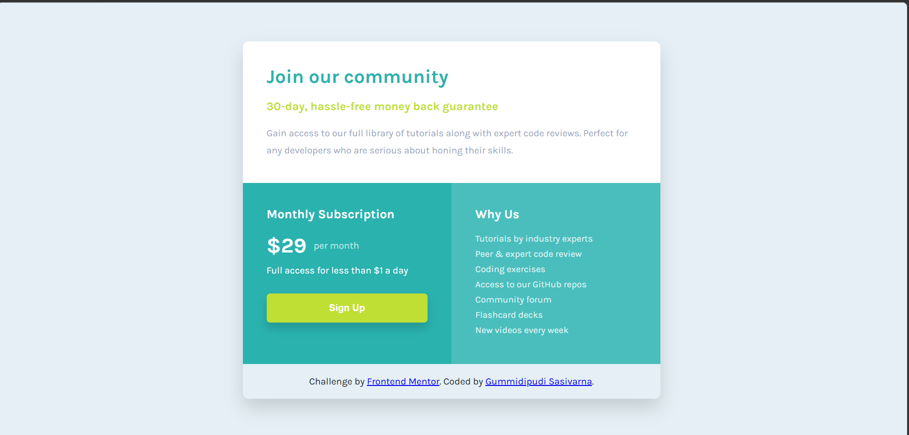

# Frontend Mentor - Single Price Grid Component Solution

This is a solution to the [Single Price Grid Component challenge on Frontend Mentor](https://www.frontendmentor.io/challenges/single-price-grid-component-5ce41129d0ff452fec5abbbc). This challenge helped me practice building responsive layouts using HTML and CSS while improving my understanding of Flexbox, CSS Grid, and responsive design principles.

---

## Table of Contents

- [Overview](#overview)
  - [The Challenge](#the-challenge)
  - [Screenshot](#screenshot)
  - [Links](#links)
- [My Process](#my-process)
  - [Built With](#built-with)
  - [What I Learned](#what-i-learned)
  - [Continued Development](#continued-development)
  - [Useful Resources](#useful-resources)
  - [AI Collaboration](#ai-collaboration)
- [Author](#author)
- [Acknowledgments](#acknowledgments)

---

## Overview

### The Challenge

Users should be able to:

- View the optimal layout for the component depending on their device's screen size
- See a hover state on desktop for the Sign Up call-to-action

---

### Screenshot



---

### Links

- Solution URL: https://github.com/Sasi-2006/Single-price-grid-component-master
- Live Site URL: https://sasi-2006.github.io/Single-price-grid-component-master/

---

## My Process

### Built With

- Semantic HTML5 markup
- CSS custom properties
- Flexbox
- CSS Grid
- Responsive Design
- Mobile-first workflow

---

### What I Learned

Through this project, I improved my understanding of responsive layouts and component structuring using HTML and CSS. I also practiced creating clean UI sections with Flexbox and Grid.

Here’s a CSS snippet I’m proud of:

```css
.bottom-section {
  display: grid;
  grid-template-columns: 1fr 1fr;
}

@media (max-width: 768px) {
  .bottom-section {
    grid-template-columns: 1fr;
  }
}
```

I also learned how to create smooth hover effects for buttons:

```css
.subscription button:hover {
  background-color: hsl(71, 73%, 48%);
}
```

---

### Continued Development

In future projects, I want to continue improving:

- Responsive layout techniques
- Accessibility best practices
- CSS animations and transitions
- Writing cleaner and more scalable CSS
- Improving mobile-first development workflow

---

### Useful Resources

- [MDN Web Docs](https://developer.mozilla.org/) - Helped me understand CSS Grid and Flexbox concepts better.
- [Frontend Mentor](https://www.frontendmentor.io/) - Great platform for practicing real-world frontend projects.
- [CSS Tricks](https://css-tricks.com/) - Useful resource for learning responsive layouts and styling techniques.

---

### AI Collaboration

I used ChatGPT during this project to:

- Understand layout structuring
- Debug CSS alignment issues
- Improve responsiveness
- Generate cleaner and optimized code
- Get suggestions for hover effects and spacing

AI assistance helped speed up development and improved my understanding of responsive design techniques.

---

## Author
- GitHub - https://github.com/Sasi-2006

---

## Acknowledgments

Thanks to Frontend Mentor for providing beginner-friendly challenges that help improve frontend development skills through practical projects.
